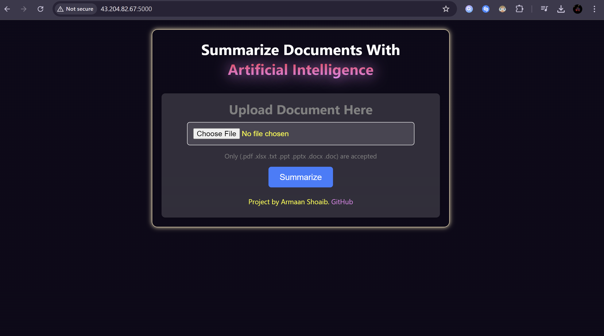

### PDF SUMMARIZER USING AI
---
- Summarize your PDF Files with the help of Artificial Intelligence.
- [Live Website (Deployed on EC2 Instance)](http://43.204.82.67:5000/)
---
### Tech Stack
- Frontend : HTML, CSS, JavaScript
- Backend : Python(Flask) & JSP (Java Server Pages)
- APIs
  1. [Convert PDF Content to Text Format](https://portal.cloudmersive.com/documentation?selected=%2fconvert%2fpdf%2fto%2ftxt&api=linkConvert&language=linkPython)
  2. [Summarize extracted PDF Text using AI](https://rapidapi.com/rphrp1985/api/chatgpt-42)
---
# Upload a file

# Get summary

